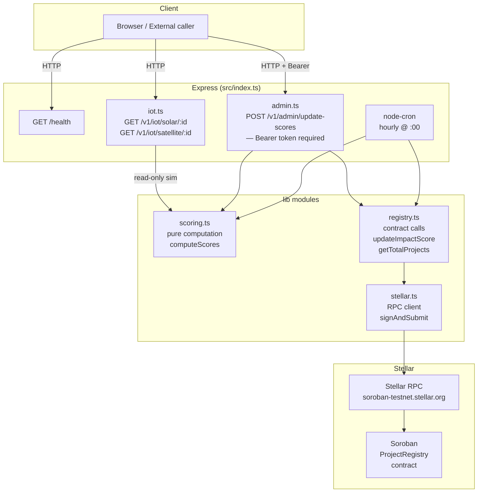

# Heliobond Backend

Node.js oracle server for the Heliobond platform. It simulates IoT sensor data for solar panel and satellite readings, computes impact scores from that data, and submits `update_impact_score` transactions to the Soroban **ProjectRegistry** contract on Stellar. An hourly cron job keeps on-chain scores current automatically; the same logic is exposed over REST for on-demand updates.

## System Overview

Heliobond is a comprehensive platform for green energy investment tracking and impact scoring. The system consists of multiple components:

- **Backend API (this repository)**: Node.js/TypeScript server that computes impact scores and interacts with the Stellar blockchain
- **Frontend**: User interface for viewing projects and impact scores
- **Blockchain Contracts**: Soroban smart contracts for project registry and investment tracking
- **Data Processing**: Components for handling IoT data and financial calculations

---

## Architecture



**Data flow for a score update** (admin route or cron):

1. `getSolarData(id)` and `getSatelliteData(id)` produce deterministic, hourly-seeded sensor readings.
2. `computeScores({ solar, satellite })` derives `credit_quality` and `green_impact` (pure, no I/O).
3. `updateImpactScore(id, cq, gi)` in `registry.ts` builds and prepares a Soroban transaction.
4. `signAndSubmit(xdr, keypair)` in `stellar.ts` signs, submits, and polls until the transaction is confirmed.

---

## API Reference

Full request/response details, validation rules, and error codes are in
[**API.md**](./API.md).

| Method | Path                      | Auth         | Description                                                |
| ------ | ------------------------- | ------------ | ---------------------------------------------------------- |
| `GET`  | `/health`                 | —            | Liveness + uptime and last cron run                        |
| `GET`  | `/v1/iot/solar/:id`       | —            | Simulated solar panel reading for project `id`             |
| `GET`  | `/v1/iot/satellite/:id`   | —            | Simulated satellite / vegetation reading for project `id`  |
| `GET`  | `/v1/projects`            | —            | Paginated list of projects with scores (`?limit=&cursor=`) |
| `GET`  | `/v1/projects/:id`        | —            | Single project detail                                      |
| `GET`  | `/v1/portfolio/:address`  | —            | Indexed deposit/withdraw history for an address            |
| `POST` | `/v1/admin/update-scores` | Bearer token | Submit impact score update(s) to the Soroban contract      |

Errors return a consistent `{ "error": { "code": "<code>", "message": "<detail>" } }`
JSON shape (never a stack trace). `code` is a stable, machine-readable
identifier; `message` is human-readable detail. All `/api/*` routes are rate
limited and return `429` with a `Retry-After` header once the limit is
exceeded.

```json
{
  "error": {
    "code": "bad_request",
    "message": "project id must be a positive integer"
  }
}
```

### `GET /health`

```json
{ "status": "ok" }
```

### Project IDs

Every `:id` path parameter is a project ID: a whole number in `1..1000000`
inclusive. The upper bound is configurable via `MAX_PROJECT_ID`.

Anything else is rejected with `400 bad_request` before the route runs — floats
(`1.5`), signed values (`-5`, `+5`), exponent notation (`1e6`), surrounding
whitespace, non-numeric strings, and IDs above the bound.

### `GET /v1/iot/solar/:id`

```json
{
  "power_output_kw": 742.15,
  "efficiency_pct": 74.21,
  "max_power_kw": 1000,
  "timestamp": 1718150400000
}
```

Readings are deterministic per `(project_id, hour)` — the same id returns the same values within a given clock hour.

Because they are deterministic, readings are cached in memory for the remainder
of the clock hour instead of being recomputed per request; `timestamp` is still
the time of the request. Set `IOT_CACHE_DISABLED=true` to recompute every time,
and `IOT_CACHE_MAX_SIZE` to cap retained entries.

### `GET /v1/iot/satellite/:id`

```json
{
  "forest_density_pct": 68.44,
  "ndvi_score": 0.684,
  "timestamp": 1718150400000
}
```

### `POST /v1/admin/update-scores`

**Headers:** `Authorization: Bearer <ADMIN_API_KEY>`

**Body (optional):**

```json
{ "project_ids": [1, 2, 3] }
```

Omit `project_ids` (or send an empty array) to update every project registered on-chain (fetched via `getTotalProjects()`).

**Response:**

```json
{
  "updated": 2,
  "results": [
    {
      "project_id": 1,
      "tx_hash": "abc123...",
      "credit_quality": 74,
      "green_impact": 69
    }
  ],
  "errors": [
    {
      "project_id": 4,
      "error": { "code": "update_failed", "message": "Soroban RPC timeout" }
    }
  ]
}
```

Soroban does not support multi-call batching; transactions are submitted sequentially.

---

## Score Formula

Both output values are integers in `[0, 100]`.

```
credit_quality = clamp(efficiency_pct, 0, 100)

green_impact   = clamp(
                   (power_output_kw / max_power_kw) * 50
                 + (forest_density_pct / 100)        * 50,
                   0, 100
                 )
```

`credit_quality` reflects how efficiently the solar array is operating.
`green_impact` is a 50/50 blend of power production ratio and vegetation health.

---

## Rate Limiting

All API endpoints are rate-limited to prevent abuse and protect against fee-drain attacks on Soroban transactions.

| Limiter | Default Window | Default Max     | Applied To                        |
| ------- | -------------- | --------------- | --------------------------------- |
| Public  | 60 seconds     | 100 requests/IP | All unauthenticated endpoints     |
| Admin   | 60 seconds     | 20 requests/IP  | All authenticated admin endpoints |

When the limit is exceeded, the API returns `429 Too Many Requests` with:

- `Retry-After` header (seconds until the window resets)
- `RateLimit-Remaining: 0` and `RateLimit-Reset` headers (RFC 6585 standard)

```json
{
  "error": {
    "code": "too_many_requests",
    "message": "Rate limit exceeded. Please retry later."
  }
}
```

Configure via environment variables (see below). Admin limits are stricter because each `POST /v1/admin/update-scores` call triggers on-chain Soroban transactions that cost XLM.

---

## Environment Variables

Create a `.env` file (see `.env.example`):

| Variable                       | Required | Default                               | Description                                                           |
| ------------------------------ | -------- | ------------------------------------- | --------------------------------------------------------------------- |
| `STELLAR_NETWORK`              | No       | `testnet`                             | `testnet` or `mainnet` — selects the network passphrase               |
| `ADMIN_SECRET_KEY`             | Yes      | —                                     | Stellar secret key (`S...`) used to sign transactions                 |
| `PROJECT_REGISTRY_CONTRACT_ID` | Yes      | —                                     | Soroban contract address for the ProjectRegistry                      |
| `RPC_URL`                      | No       | `https://soroban-testnet.stellar.org` | Stellar RPC endpoint                                                  |
| `PORT`                         | No       | `3001`                                | HTTP port the server listens on                                       |
| `FRONTEND_URL`                 | No       | `http://localhost:3000`               | Origin allowed by CORS                                                |
| `ADMIN_API_KEY`                | No       | —                                     | Bearer token for `/api/admin/*`. If unset, auth is skipped (dev only) |
| `RATE_LIMIT_WINDOW_MS`         | No       | `60000`                               | Public rate-limit window (ms)                                         |
| `RATE_LIMIT_MAX`               | No       | `100`                                 | Public max requests per IP per window                                 |
| `RATE_LIMIT_ADMIN_WINDOW_MS`   | No       | `RATE_LIMIT_WINDOW_MS`                | Admin rate-limit window (ms)                                          |
| `RATE_LIMIT_ADMIN_MAX`         | No       | `20`                                  | Admin max requests per IP per window                                  |
| `POLL_INTERVAL_MS`             | No       | `1500`                                | Stellar transaction confirmation polling interval (ms)                |
| `POLL_MAX_ATTEMPTS`            | No       | `20`                                  | Max polling attempts before timing out                                |
| `TX_TIMEOUT_SECONDS`           | No       | `30`                                  | Soroban transaction timeout (seconds)                                 |
| `MAX_POWER_KW`                 | No       | `1000`                                | Maximum simulated solar power output (kW)                             |
| `IOT_CACHE_DISABLED`           | No       | —                                     | `true` bypasses the in-memory IoT reading cache                       |
| `IOT_CACHE_MAX_SIZE`           | No       | `1000`                                | Max cached IoT readings; oldest are evicted first                     |
| `MAX_PROJECT_ID`               | No       | `1000000`                             | Inclusive upper bound accepted for a `:id` project param              |
| `BODY_SIZE_LIMIT`              | No       | `100kb`                               | Max request body size accepted by `express.json()` (e.g. `100kb`, `1mb`). Requests exceeding it return `413 Payload Too Large` |

---

## Getting Started

Prerequisites: [Bun](https://bun.sh) (`curl -fsSL https://bun.sh/install | bash`).

```bash
# 1. Install dependencies
bun install

# 2. Configure environment
cp .env.example .env
# Edit .env — ADMIN_SECRET_KEY and PROJECT_REGISTRY_CONTRACT_ID are required to
# start the server; the rest have sensible defaults.

# 3. Development (ts-node + hourly cron + 5-min indexer)
bun run dev          # -> Heliobond backend listening on port 3001
                     #    watches src/ and restarts on save
bun run dev:no-watch # same, without file watching

# Verify it's up
curl http://localhost:3001/health

# Production
bun run build && bun start

# Quality gate
bun run build        # tsc type-check
bun run test         # jest suite
```

## Dependency Audit

Dependency vulnerability checks run in the CI workflow for every pull request. The audit gate uses `npm audit --audit-level=high`, so CI fails when npm reports any high or critical dependency vulnerabilities. Moderate and low findings are still included in the workflow summary for visibility.

Run the same audit locally before opening a PR:

```bash
npm audit --audit-level=high
```

Use `npm audit --json` if you need machine-readable details while triaging a finding.

## Deployment

### Docker

Build and run using Docker:

```bash
docker build -t heliobond-backend .
docker run -p 3001:3001 --env-file .env heliobond-backend
```

### Docker Compose

Use the provided docker-compose.yml for local development with all dependencies:

```bash
docker-compose up
```

### Production Deployment

For production deployments, consider:

1. Using a process manager like PM2 or systemd
2. Setting up a reverse proxy (Nginx, Caddy)
3. Configuring SSL/TLS certificates
4. Implementing proper monitoring and alerting

## Monitoring and Observability

The application includes OpenTelemetry instrumentation for:

- **Distributed Tracing**: Track requests across services
- **Metrics**: Monitor performance and resource usage
- **Logging**: Structured logging with correlation IDs

Configure OpenTelemetry exporters in your environment to send data to your preferred observability platform (Jaeger, Zipkin, Prometheus, etc.).

---

## Tech Stack

| Layer                         | Technology                 |
| ----------------------------- | -------------------------- |
| Runtime                       | Node.js 20                 |
| Language                      | TypeScript                 |
| HTTP framework                | Express 5                  |
| Stellar SDK                   | `@stellar/stellar-sdk` v15 |
| Scheduler                     | `node-cron` v4             |
| Package manager / test runner | Bun                        |
| Test framework                | Jest + ts-jest + Supertest |
| Database                      | PostgreSQL (via Knex.js)   |
| API Documentation             | Swagger/OpenAPI            |
| Monitoring                    | OpenTelemetry              |
| Containerization              | Docker                     |
| CI/CD                         | GitHub Actions             |

## Development Guidelines

### Code Quality

- Use TypeScript strict mode
- Follow ESLint and Prettier configuration
- Write comprehensive tests for new features
- Maintain test coverage above 80%

### Testing

Run the test suite with:

```bash
bun run test           # Run all tests
bun run test:coverage  # Run tests with coverage report
```

### Code Style

- Use meaningful variable and function names
- Add JSDoc comments for public APIs
- Follow the existing code patterns and architecture
- Keep functions small and focused on single responsibilities

## API Documentation

Comprehensive API documentation is available in multiple formats:

### Interactive Documentation

After starting the server, visit `http://localhost:3001/docs` for interactive Swagger UI documentation.

### API Specification

The full OpenAPI specification is available at `http://localhost:3001/docs.json`.

### API.md Reference

Detailed API reference with examples and error codes is available in [API.md](./API.md).

## Changelog

Notable changes for each version are recorded in [CHANGELOG.md](./CHANGELOG.md),
which follows [Keep a Changelog](https://keepachangelog.com/en/1.0.0/). Released
sections are generated by semantic-release from Conventional Commits; add
unreleased work under `## [Unreleased]` using the template at the bottom of the
file.

## Contributing

Please read [CONTRIBUTING.md](./CONTRIBUTING.md) for details on our code of conduct and the process for submitting pull requests.

## Security

For security concerns, please review [SECURITY.md](./SECURITY.md) and report vulnerabilities through the appropriate channels.

## License

This project is licensed under the terms in the [LICENSE](./LICENSE) file.


